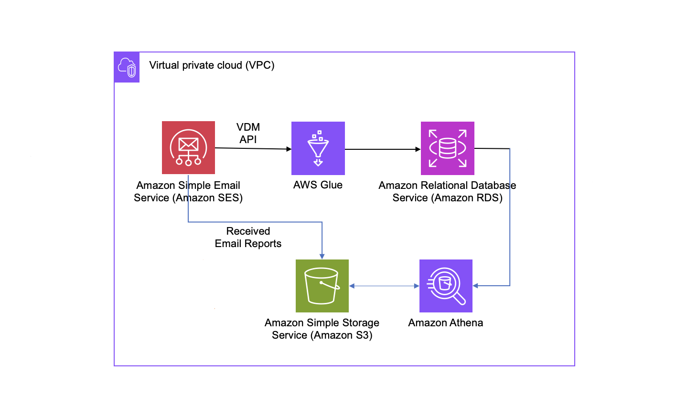

# vdm-to-rds

## VDM Data ingestion Overview

Ingest data into MySQL (or RDS version of your choice) to enable reporting outside of the Virtual Deliverability Manager. Amazon Glue jobs query the VDM API daily and store the summarized data in an Amazon RDS MySQL database. 

## Prerequisites

The SES API is newer than the boto3 version available in AWS Glue. To make the new functions available, download the appropriate whl files and put them in an S3 bucket for later use in job configuration.

* [awscli 1.29.83](https://pypi.org/project/awscli/1.29.83/#files)
* [boto3 1.28.83](https://pypi.org/project/boto3/1.28.83/#files)

## Set Up VDM
To have the API available, ensure you have configured VDM. Refer to [Virtual Deliverability Manager Getting started](https://docs.aws.amazon.com/ses/latest/dg/vdm-get-started.html) for set up instructions.

## Create MySQL RDS Database
Navigate to RDS from the AWS Console. On the Splash screen click “Create Database”. Be sure to set the DB instance identifier to be ***sesvdm***. 
* Check the box to Manage master credentials in AWS Secrets Manager. 
* Select Connect to an EC2 compute resource, if desired.
* Choose an existing VPC security group with available routes to the S3 and Secrets Manager endpoints.
* For DB subnet group, select Choose existing. Select the subnet group from the drop down that aligns to the endpoints. 
* All other fields leave as defaults. 
* Click Create database. It will take a few minutes to become available.

Once the database is available. Connect to it and run the provided [sesvdmdb.sql](sesvdmdb.sql) to create the tables to be imported into.

## Create retrieval AWS Glue job

This job will run a pyspark script to call the VDM API for dates based on a file with the last date of processing in the sesvdmbucket, retrieve the results and store them as csv files in the sesvdmbucket. There are 6 main sections in the script to retrieve each of the 6 different style of metrics.

* On your PC, create a file named ***lastvdmdate.csv*** containing just the first date you want to retrieve metrics from. See example in the screenshot. Upload the file to the bucket where you will store data, something like sesvdmbucket.
    * 

* Navigate to AWS ETL Jobs and click Script Editor
* Create a new script named importLastestVDM. Copy the text from [importLastestVDM.py](importLatestVDM.py) and paste it into the script tab. Optionally, download the file and import it.
* In order to make the whl files available for the newer boto3 version, open Advanced properties and scroll down to Libraries.
    * In Python library path, put the S3 URI path to the awscli-1.29.83-py3-none-any.whl from Prerequisites
    * Add the following three Job parameters
        * *key*: —additional-python-modules *value*: s3://*path to downloaded file*/boto3-1.28.83-py3-none-any.whl,boto3==1.28.83
        * *key*: —python-modules-installer-option *value*: update
        * *key*: —bucketname *value*: sesvdmbucket

## Create ingestion AWS Glue job

This job will run a pyspark script to process the csv files in the sesvdmbucket. It will loop through all the files, parse the file name to determine the destination table and metric data and insert the data into MySQL.

* Navigate to AWS ETL Jobs and click Script Editor
* Create a new script named metricstoMySQL. Copy the text from [metricstoMySQL.py](metricstoMySQL.py) and paste it into the script tab. Optionally, download the file and import it.
* This job has one customer parameter. Open Advanced properties and scroll down to Connections.
    * Add the Glue connection to your database (this will need to be created before hand)
    * Add the following Job parameter
        * *key*: —bucketname *value*: sesvdmbucket

## Bring it all together

Once you have the database and two Glue jobs, create a Glue workflow to be triggered at midnight. Your workflow should look like this one.
